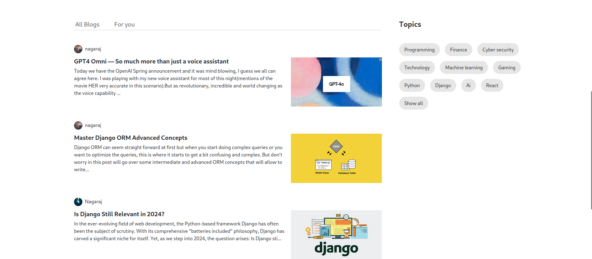

# BLOGOSPHARE Blog Website
Welcome to my first Django project! This blog website is a platform where I'm honing my skills in Django development while also sharing my thoughts and experiences with the world. As I continue to learn and grow as a developer, I'll be adding new features and improvements to the website.

### Website ER Model:

### Technologies Used:
- Django Framework
- Django Rest Framework
- HTML, CSS, JS
- Boostrap
    

## Website Screenshot

---

---

---

---

